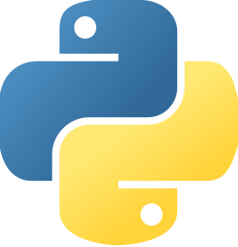

```{r, echo=FALSE}
library(fontawesome)
```


<!-- Βάλε σε λογική σειρά τα projects - Scraping project - Ανάλυση - API - APP -->

# Aside

<div class = "image-link">

</div>

## Contact Info {#contact}
-   <i class="fa fa-envelope"></i> [stesiam@proton.me](mailto:stesiam@proton.me){.email}
-   <i class="fa fa-skype" aria-hidden="true"></i> [\@stesiam](https://github.com/stesiam)
-   <i class="fab fa-mastodon" aria-hidden="true"></i> [\@stesiam](https://fosstodon.org/@stesiam)
-   <i class="fa fa-map-marker" aria-hidden="true"></i> Athens, Greece

## Portfolio {#contact}

-   <i class="fa fa-globe" aria-hidden="true"></i> [stesiam.com](https://www.stesiam.com/)
-   <i class="fa fa-pie-chart" aria-hidden="true"></i> [Shiny Apps](https://www.stesiam.com/shiny.html)
-   <i class="fa fa-paint-brush" aria-hidden="true"></i> [Gallery](https://www.stesiam.com/gallery.html)
-   <i class="fa fa-github"></i> [\@stesiam](https://github.com/stesiam)
-   <i class="fa fa-youtube" aria-hidden="true"></i> [\@stesiam](https://www.youtube.com/@stesiam)

## Programming Skills {#skills}

- • R 
- • JavaScript (DOM)
- • Python (beginner)

## Project Skills {#skills}

- • Linux (Ubuntu)
- • Git
- • LaTeX
- • HTML/CSS
- • Docker
- • Shiny
- • Data analysis
- • Machine learning

##  Languages {#skills}

- • Greek (native speaker)
- • English (C2)
- • Swedish (A2)

## Notes {#skills}

- • Prefer hybrid/remote job 
- • Available for relocation (EU)

## Disclaimer {#disclaimer}

\vspace*{\fill}
Last updated on `r Sys.setlocale("LC_TIME","en_US.UTF-8"); format(Sys.time(), '%b %d, %Y')`


# Main

## stesiam {#title}

### Undergraduate student | R Enthusiast

My name is Stelios and I live in Athens, Greece. Currently, I am an undergraduate student of [Statistics and Insurance Science](https://www.unipi.gr/unipi/en/sta-home-en.html) (exp. graduate Sept, 2024). R is my go-to tool for my data-analysis tasks. I have some hands-on experience, by writing notebooks and developing some simple Shiny apps. I would like to further enhance my knowledge - skills, concerning R, in a working environment.

## Projects {data-icon="suitcase"}

### Scraping Project `r fa(name = "r-project", fill = "steelblue")`

[GitHub Repo](https://stesiam.github.io/gallery.html)

N/A

N/A

An analysis based on Kaggle's recent survey (2022). My analysis focuses primarily on Greek users. Comparing them with the rest users of Kaggle, I came up with interesting facts as. 


### EDA on Kaggle's Greek Community  `r fa(name = "r-project", fill = "steelblue")`

[Gallery](https://stesiam.github.io/gallery.html)

N/A

N/A

An analysis based on Kaggle's recent survey (2022). My analysis focuses primarily on Greek users. Comparing them with the rest users of Kaggle, I came up with interesting facts as. 


### Search for Possible Clients  `r fa(name = "r-project", fill = "steelblue")`

[Notebook Link](https://stesiam.github.io/notebooks/2022-11-24-Predict-Possible-Clients/2022-11-24-Predict-Possible-Clients.html)

N/A

N/A

Developing a machine learning model (LightGBM, XGBoost) in order to classify clients based on their interest to create a term deposit account (Yes / No). The best performant model has a satisfactory accuracy (88.9 \%) . On this case-scenario the company will not have to call all their clients (1132) but they can focus only on the predicted ones (75). The use of the model decreases 93% the working hours.


### API Project  

[DockerHub](https://stesiam.shinyapps.io/Ship-Passengers/) | [GitHub Repo](https://stesiam.shinyapps.io/Ship-Passengers/)

N/A

N/A

Using 4 years of historical data, I have developed a model to predict tomorrow's ship passengers and cars. The app uses the Rhino framework, which is the newest approach to make Shiny Apps. For UI purposes I have used **HTML** (Shiny tags) and **SASS**. Furthermore, the app uses API in order to get the data from data.gov.gr and tools to retrieve those automatically (CI/CD). 


### Ship Travellers  `r fa(name = "r-project", fill = "steelblue")`  

[Shiny App](https://stesiam.shinyapps.io/Ship-Passengers/)

N/A

N/A

Using 4 years of historical data, I have developed a model to predict tomorrow's ship passengers and cars. The app uses the Rhino framework, which is the newest approach to make Shiny Apps. For UI purposes I have used **HTML** (Shiny tags) and **SASS**. Furthermore, the app uses API in order to get the data from data.gov.gr and tools to retrieve those automatically (CI/CD). 


## Education {data-icon="graduation-cap" data-concise="true"}

### BSc. in Statistics and Insurance Science

[University of Piraeus](https://www.unipi.gr/unipi/en/sta-home-en.html)

Piraeus, Greece

current - 2016


During my studies, I was taught several statistics-related courses and had some exposure to statistical programs. Indicatively, Probabilities, Statistics: Estimation Theory, Non-parametric Statistics, Sampling and Statistical Programs using R are some of the most influential courses that helped me develop my knowledge regarding Statistics.